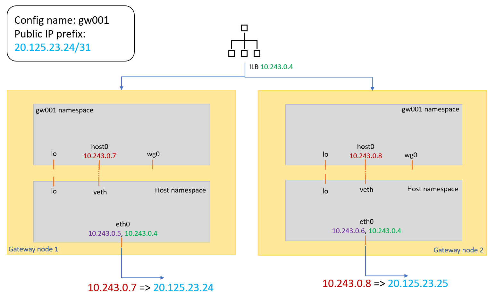

# Design Doc

kube-egress-gateway routes egress traffic from pods on regular kubernetes worker nodes to dedicated gateway nodes, which are configured with secondary ipConfigs and public IP prefixes, and thus uses different, configurable egress source IPs other than the default kubernetes cluster egress IP, usually via the outbound load balancer or natGateway. This document provides details about how it works.

## Prerequisite

kube-egress-gateway needs at least two of dedicated kubernetes nodes backed by Azure virtual machine scale set (VMSS) as egress gateway to work. In Azure Kubernetes Service (AKS, managed kubernetes service on Azure) terminology, this is called a "nodepool". We use "nodepool" in this document for simplicity but it's not limited to AKS only. Users with self-managed kubernetes clusters can still use this feature, just by deploying a dedicated Azure VMSS and adding them to the cluster. There are some requirements for the nodepool:
* It will be configured with additional secondary IP configurations on its NIC by kube-egress-gateway operator, and each secondary IP configuration is associated with a public IP prefix as outbound IP.
* It has a fixed maximum node size (public ip prefix size), and should have cluster auto-scaler disabled.
* It should be tainted (`mode=gateway:NoSchedule`) permanently so that no normal workload would land on it. 
* It also has label `kubernetes.azure.com/mode: gateway` for nodeSelector.
* The nodepool VMSS instances should be linux only.
* The cluster cannot use [Azure CNI with Dynamic IP allocation](https://learn.microsoft.com/en-us/azure/aks/configure-azure-cni-dynamic-ip-allocation) as CNI plugin due to known issue.
* Deploying multiple gateway nodepools (multiple VMSSes) is supported. But single nodepool cannot contain multiple VMSSes.

> Note: AKS managed kube-egress-gateway addon and gateway nodepool are not supported, **yet**. Please refer to [TODO](TODO) for an example to provision a self-managed cluster and gateway nodepool with [Cluster API Provider for Azure](https://capz.sigs.k8s.io/).

## Static Egress Gateway Provisioning

When the gateway nodepool is created, there is no gateway to use. A user should create a namespaced `StaticGatewayConfiguration` CRD object to create an egress gateway configuration, specifying the target gateway nodepool, and optional BYO public IP prefix. Users can then annotate the pod (`kubernetes.azure.com/static-gateway-configuration: <gateway config name, e.g. aks-static-gw-001>`) to claim a static gateway configuration as egress.

The kube-egress-gateway operator watches for `StaticGatewayConfiguration` CR. It first deploys an internal load balancer (ILB) in front of the gateway nodepool if not already existing. Then it creates a secondary ipConfig on the gateway vmss associating either user-provided BYO public ip prefix or a system managed one. On each gateway node, there is a gateway daemon deployed as a kubernetes DaemonSet, which watches for these changes and configures the gateway node, creating network namespace, setting routes and iptables rules.

In below image, the gateway nodepool has two nodes. We usually deploy multiple nodes for high availability. User creates a `StaticGatewayConfiguration` called `gw001` with specified public ip prefix "20.125.23.24/31". The operator places an ILB in front of the nodes so pod traffic can be sent to either node. The operator also creates a secondary ipConfiguration on each node. The ipConfiguration attaches the public ip prefix and has private IP 10.243.0.7/10.243.0.8 respectively. Thus when a packet is sent out from the gateway node with one of these private IPs, the packet will have one of the public IPs from the public ip prefix "20.125.23.24/31" on the Internet. This step is done by Azure Networking Stack. The gateway daemon on each node creates a new network namespace called `gw001` in the image. Each namespace has a `wg0` interface. Node wireguard daemon routes traffic from wireguard tunnel to this interface. The daemon also creates a veth pair between node's host and gateway network namespace (`host0` in the image). `host0` interface has node's secondary ipConfiguration private IP configured. The daemon creates routes to direct traffic from `wg0` to `host0` and masquades the packets with `host0`'s IP. Detailed traffic flow will be shown in next image.

## Pod Egress Provisioning

Users can then annotate the pod (`kubernetes.azure.com/static-gateway-configuration: <gateway config name, e.g. gw001>`) to claim a static gateway configuration as egress. kube-egress-gateway CNI plugin, working as a chained CNI plugin, configures a WirGuard interface and routes in the pod namespace so that pod default traffic can be forwarded to the gateway nodepool.

Out-of-cluster packets from pod containers are sent via the pod's `wg0` interface, encrypted and encapped by the wireguard daemon in host namespace and then sent out from the node, with the node IP as source and the wireguard endpoint IP (in this case the ILB frontend IP) as destination. The packets are directed to one of the gateway nodes by ILB. The node receives them from its `eth0` interface in the host network namespace. The wireguard daemon listening in the host namespace decrypts the packets and sends them into the corresponding network namespace via `wg0` interface. The packets are routed to `host0` interface and then masqueraded with the VMSS instance's secondary interface private IP belonging to that configuration, sent through the veth pair to the host namespace and then out from the `eth0` interface in node's host network namespace. Internet will see these packets with source IP as one of the gateway configuration's public ip prefix. Reverse traffic is handled automatically by conntrack. Below image displays the traffic flow.

## CRDs

* `StaticGatewayConfiguration`: Users manipulate gateway configurations with this CRD.
* `GatewayLBConfiguration`: Used to reconcile gateway ILB status. Users no need to take care in most time.
* `GatewayVMConfiguration`: Used to reconcile gateway VMSS status. Users no need to take care in most time.
* `GatewayNodeStatus`: Used to display gateway node status. Users no need to take care in most time.
* `PodWireguardEndpoint`: Shows pod side wireguard configuration. Users no need to take care in most time.

## Components

* **kube-egress-gateway-cni-manager**: DaemonSet on normal gateway nodes to install kube-egress-gateway CNI plugin and behaves as a proxy between CNI plugin and cluster apiserver.
* **kube-egress-gateway-controller-manager**: kube-egress-gateway operator. Monitor `StaticGatewayConfiguration` CRs and reconcile Azure ILB and VMSS.
* **kube-egress-gateway-daemon-manager**: DaemonSet only on gateway nodes and setup gateway network namespaces.
