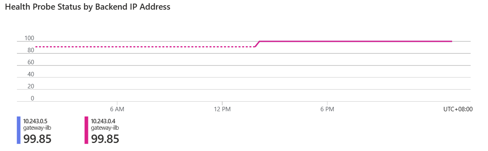

# Troubleshooting

This document provides steps to troubleshoot pod outbound connectivity issue when kube-egress-gateway is in use. Troubleshooting contains two steps:
1. Validate static egress gateway is successfully provisioned and egress traffic has right source IP.
2. Validate pod provisoning and pod-gateway connectivity.

## StaticGatewayConfiguration Validation

### Check StaticGatewayConfiguration CR status
The first step is to check whether kube-egress-gateway controller has successfully provisioned Azure resources for your egress gateway. The controller reports status in `StaticGatewayConfiguration` CR object. Run `kubectl get staticgatewayconfigurations -n <your namespace> <your sgw name> -o yaml` to check:
```yaml
apiVersion: egressgateway.kubernetes.azure.com/v1alpha1
kind: StaticGatewayConfiguration
metadata:
  ...
spec:
  ...
status:
  gatewayServerProfile:
    PrivateKeySecretRef:
      apiVersion: v1
      kind: Secret
      name: <your sgw name>
    PublicKey: ***
    Ip: 10.243.0.6 # ilb private IP in your vnet
    Port: 6000
  egressIpPrefix: 1.2.3.4/31 # egress public IP prefix
```
The controller creates a secret storing the gateway side wireguard private key with the same namespace and name as your `StaticGatewayConfiguration`. This information is displayed in `.status.gatewayServerProfile.PrivateKeySecretRef` field. `PublicKey` is base64 encoded wireguard public key used by the gateway. `Ip` is the gateway ILB frontend IP. This IP comes from the subnet provided in Azure cloud config. `Port` is LoadBalancing rule frontend and backend port. All `StaticGatewayConfiguration`s deployed to the same gateway VMSS share the same ILB frontend and backend but have separate LoadBalancing rules with different ports. And most importantly, `egressIpPrefix` is the egress source IPNet of the pods using this gateway. If you see any of these not showing in status, you can describe the CR objects and see if there are error events:
```bash
$ kubectl describe staticcgatewayconfiguration -n <your namespace> <your sgw name>
$ kubectl describe gatewaylbconfiguration -n <your namespace> <your sgw name> # gatewaylbconfiguration and gatewayvmconfiguration are two internal CRDs to reconcile gateway ilb and vmss status.
$ kubectl describe gatewayvmconfiguration -n <your namespace> <your sgw name>
```

Furthermore, you can check `kube-egress-gateway-controller-manager` log and see if there's any error:
```bash
$ kubectl logs -f -n kube-egress-gateway-system kube-egress-gateway-controller-manager-**********-*****
```

### Check GatewayStatus CR
Gateway DaemonSet controller manages another CR: `GatewayStatus` to record configurations on each node. This is for purely debugging purpose. Run `kubectl get gatewaystatus -A` to show existing `GatewayStatus` resources in the cluster:
```
+ kubectl get gatewaystatus -A
NAMESPACE                    NAME                     AGE
kube-egress-gateway-system   <gateway nodes 1 name>   107s
kube-egress-gateway-system   <gateway nodes 2 name>   106s
``` 
You should see one `GatewayStatus` object for each gateway node, with the same name as the node. *If you don't see any object created, that means gateway daemon is still working or has encountered some error.*

Look into a specific `GatewayStatus` object:
```yaml
apiVersion: egressgateway.kubernetes.azure.com/v1alpha1
kind: GatewayStatus
metadata:
  namespace: ...
  name: ...
  ownerReferences: <node object>
spec:
  readyGatewayNamespaces:
  - netnsName: gw-<StaticGatewayConfiguration obj GUID>-<ServerIP>
    staticGatewayConfiguration: <sgw namespace>/<sgw name>
  - ...
```
Check `.spec.readyGatewayNamespaces` list and see if your `StaticGatewayConfiguration` is included. If included, it means the network namespace corresponding to the gateway is successfully provisioned. Otherwise, you can check `kube-egress-gateway-daemon-manager` log on the same node:
```bash
$ kubectl logs -f -n kube-egress-gateway-system kube-egress-gateway-daemon-manager-*****
``` 

### Login to the node
After checking the CR objects, you can login to the gateway node and check network settings directly:

* Check network namespace, namespace name in format `gw-<SGC .metadata.uid>-<SGC .status.gatewayServerProfile.Ip>`:
  ```bash
  $ ip netns
  gw-17f83d68-4cab-422d-a3af-ed320a761cee-10_243_0_6 (id: 0)
  ```
* Check network interfaces, routes, iptables rules within the network namespace:
  ```bash
  $ ip netns exec gw-17f83d68-4cab-422d-a3af-ed320a761cee-10_243_0_6 ip addr
  1: lo: <LOOPBACK,UP,LOWER_UP> mtu 65536 qdisc noqueue state UNKNOWN group default qlen 1000
    link/loopback 00:00:00:00:00:00 brd 00:00:00:00:00:00
    inet 127.0.0.1/8 scope host lo
       valid_lft forever preferred_lft forever
    inet6 ::1/128 scope host
       valid_lft forever preferred_lft forever
  4: wg0: <POINTOPOINT,NOARP,UP,LOWER_UP> mtu 1420 qdisc noqueue state UNKNOWN group default qlen 1000 # wireguard interface
    link/none
    inet6 fe80::1/64 scope link
       valid_lft forever preferred_lft forever
  5: host0@if6: <BROADCAST,MULTICAST,UP,LOWER_UP> mtu 1500 qdisc noqueue state UP group default qlen 1000 # veth pair with host network namespace
    link/ether 8a:4c:4c:a9:ae:ea brd ff:ff:ff:ff:ff:ff link-netnsid 0
    inet 10.243.0.7/32 scope global host0
       valid_lft forever preferred_lft forever
    inet6 fe80::884c:4cff:fea9:aeea/64 scope link
       valid_lft forever preferred_lft forever
  $ ip netns exec gw-17f83d68-4cab-422d-a3af-ed320a761cee-10_243_0_6 ip route
  default via 10.243.0.4 dev host0
  10.243.0.4 dev host0 scope link
  $ ip netns exec gw-17f83d68-4cab-422d-a3af-ed320a761cee-10_243_0_6 iptables-save # traffic is masqueraded
  *nat
  :PREROUTING ACCEPT [0:0]
  :INPUT ACCEPT [0:0]
  :OUTPUT ACCEPT [0:0]
  :POSTROUTING ACCEPT [0:0]
  -A POSTROUTING -o host0 -j MASQUERADE
  COMMIT
  ```
* Check wireguard setup, public key and listening port should match SGW `.status.gatewayServerProfile.PublicKey` and `.status.gatewayServerProfile.Port` respectively:
  ```bash
  $ ip netns exec gw-17f83d68-4cab-422d-a3af-ed320a761cee-10_243_0_6 wg
  interface: wg0
    public key: ******
    private key: (hidden)
    listening port: 6000
  ```
  *Note: if `wg` command does not exist, run `apt isntall wireguard-tools` to install*

**Lastly, run `curl ifconfig.me` inside the network namespace to check traffic egress IP**, if connectivity is fine and you get expected egress IP, then `StaticGatewayConfiguration` provision is successful!
```bash
$ ip netns exec gw-17f83d68-4cab-422d-a3af-ed320a761cee-10_243_0_6 curl ifconfig.me
XXX.XXX.XXX.XXX
```
## Pod Validation

### Check pod state
Firstly, check whether pod is in "Running" state. If pod gets stuck in "ContainerCreating" state, this means kube-egress-gateway CNI plugin might have some difficulties configuring the pod network namespace. Check kubelet log for any errors. CNI plugin configuration is stored in `/etc/cni/net.d/` and the default conflist file name is called `01-egressgateway.conflist`. Check if the file exists and if it's the first file in alphabet order under `/etc/cni/net.d/` to make sure it can take effect. You may also check cni manager's log and look for any errors:
```bash
$ kubectl logs -f -n kube-egress-gateway-system kube-egress-gateway-cni-manager-*****
```

### Check PodEndpoint CR
For each pod using an egress gateway, kube-egress-gateway CNI plugin creates a corresponding `PodEndpoint` CR in the pod's namespace, with the same name as the pod. This CR contains pod side wireguard configurations so that gateway side can add it as a peer. You can view the details about this object by running `kubectl get podendpoint -n <pod namespace> <pod name> -o yaml`:
```yaml
apiVersion: egressgateway.kubernetes.azure.com/v1alpha1
kind: PodEndpoint
metadata:
  ...
spec:
  podIpAddress: XXX.XXX.XXX.XXX/32
  podPublicKey: **********
  staticGatewayConfiguration: <SGC name>
```
Pod IPNet (provisioned by the main CNI plugin in the cluster), pod side wireguard public key and the `StaticGatewayConfiguration` name are provided. Make sure this object exists. Otherwise, look for CNI plugin error from kubelet log.

### Check pod network namespace

You can run [crictl](https://kubernetes.io/docs/tasks/debug/debug-cluster/crictl/) to get pod's network namespace and check network and wireguard setup inside pod's network namespace:
```bash
$ ip netns exec cni-***** ip addr # cni-**** is pod's netns
1: lo: <LOOPBACK,UP,LOWER_UP> mtu 65536 qdisc noqueue state UNKNOWN group default qlen 1000
    link/loopback 00:00:00:00:00:00 brd 00:00:00:00:00:00
    inet 127.0.0.1/8 scope host lo
       valid_lft forever preferred_lft forever
    inet6 ::1/128 scope host
       valid_lft forever preferred_lft forever
2: eth0@if24: <BROADCAST,MULTICAST,UP,LOWER_UP> mtu 1500 qdisc noqueue state UP group default # provisioned by the main CNI plugin
    link/ether b6:ee:c6:23:00:99 brd ff:ff:ff:ff:ff:ff link-netnsid 0
    inet 10.244.0.20/24 brd 10.244.0.255 scope global eth0
       valid_lft forever preferred_lft forever
    inet6 fe80::b4ee:c6ff:fe23:99/64 scope link
       valid_lft forever preferred_lft forever
25: wg0: <POINTOPOINT,NOARP,UP,LOWER_UP> mtu 1420 qdisc noqueue state UNKNOWN group default qlen 1000 # provisioned by kube-egress-gateway CNI plugin
    link/none
    inet6 fe80::b4ee:c6ff:fe23:99/64 scope link # same as eth0 inet6 ip
       valid_lft forever preferred_lft forever

$ ip netns exec cni-***** ip route
default via inet6 fe80::1 dev wg0
10.244.0.1 dev eth0 scope link

$ ip netns exec cni-***** ip rule # make sure response packets from ingress NOT routed to gateway
0:      from all lookup local
32765:  from all fwmark 0x2222 lookup 8738
32766:  from all lookup main
32767:  from all lookup default

$ ip netns exec cni-***** iptables-save
*mangle
:PREROUTING ACCEPT [0:0]
:INPUT ACCEPT [0:0]
:FORWARD ACCEPT [0:0]
:OUTPUT ACCEPT [0:0]
:POSTROUTING ACCEPT [0:0]
-A PREROUTING -i eth0 -j MARK --set-xmark 0x2222/0xffffffff
-A PREROUTING -j CONNMARK --save-mark --nfmask 0xffffffff --ctmask 0xffffffff
-A OUTPUT -m connmark --mark 0x2222 -j CONNMARK --restore-mark --nfmask 0xffffffff --ctmask 0xffffffff
COMMIT

$ ip netns exec cni-***** wg
interface: wg0
  public key: ********** # should be same as the one in PodEndpoint CR
  private key: (hidden)
  listening port: 56959 # random

peer: ********** # gateway side wireguard public key
  endpoint: 10.243.0.6:6000 # <ilb frontend IP>:<LB rule port>
  allowed ips: 0.0.0.0/0, ::/0
  latest handshake: 1 hour, 1 minute, 8 seconds ago # wireguard connectivity is GOOD!
  transfer: 4.37 KiB received, 4.99 KiB sent
```

In particular, the handshake and transfer statistics from `wg` command verifies connectivity from wireguard tunnel.

### Check gateway peer configuration

You can run `wg` command on the gateway node to see the peer is added:
```bash
$ ip netns exec gw-17f83d68-4cab-422d-a3af-ed320a761cee-10_243_0_6 wg
interface: wg0
  public key: **********
  private key: (hidden)
  listening port: 6000

peer: ********** # pod's wireguard public key
  endpoint: 10.243.4.4:56959 
  allowed ips: 10.244.0.20/32 # pod's IP
  latest handshake: 9 minutes, 2 seconds ago # wireguard connectivity is GOOD!
  transfer: 3.80 KiB received, 4.49 KiB sent
```

Also, a `readyPeer` should be added in `GatewayStatus` CR:
```yaml
apiVersion: egressgateway.kubernetes.azure.com/v1alpha1
kind: GatewayStatus
metadata:
  ...
spec:
  readyGatewayNamespaces:
    ...
  readyPeerConfigurations:
  - netnsName: gw-17f83d68-4cab-422d-a3af-ed320a761cee-10_243_0_6
    podEndpoint: <pod namespace>/<pod name>
    publicKey: ****** <pod's wireguard public key>
```
### Check LoadBalancer health probe

One important step to troubleshoot pod egress connectivity is to make sure traffic can be routed to one of the gateway VMSS instance by gateway ILB. For this, you need to check Azure LoadBalancer health probe status and see if backends are available:


### Take packet capture

If all above configurations look correct, the last step is to take packet capture. You can run [tcpdump](https://www.tcpdump.org/) to trace the egress packets.

To run `tcpdump` inside a network namespace:
```bash
$ ip netns exec <network ns name> tcpdump -i <interface> -vvv
```
# Known Limitations

* Due to lack of native support for Wireguard on windows, pods in windows nodepools cannot use this feature and gateway nodepool itself is limited to linux also.
* Due to IPv6 secondary IP config limitation , this feature currently is not supported in dual-stack clusters.
* Because we use CNI to setup pods' side network, existing pods must be restarted to use this feature.